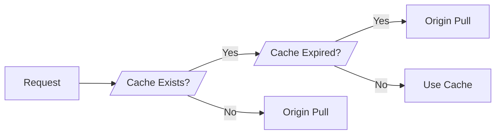

CDN reduces the distance between the user and the assets.


## Lookup

```seq
Client -> Local: Domain Name
Local -> DNS: Domain Name
DNS -> Local: CDN Auth IP
Local -> CDN Auth: Domain Name
CDN Auth -> Local: CDN Content IP
Local -> Client: CDN Content IP
```

## Cluster Selection Strategies

1. **Geographically closest**: select the CDN cluster that is closest to the user's location based on their IP address.
2. **RTT closest**: select the CDN cluster that has the lowest round-trip time to the user's location.

## Cache Update

If the CDN does not storing the assets or the assets are expired, then the assets needs to be updated.

1. **Push**: manually push the assets to the origin server, then propagate to other CDN
2. **Pull**: CDN automatically pull the assets from the origin server (or another CDN cluster)



> **Canary Deployment**
>
> allows a small percentage of users to access the updated content, thus updating the CDN cache.

## Servers

| Type                     | Description                          |
| ------------------------ | ------------------------------------ |
| CDN Authoritative Server | Domain Name -> CDN Content Server IP |
| CDN Content Server       | Domain Name -> Content               |
