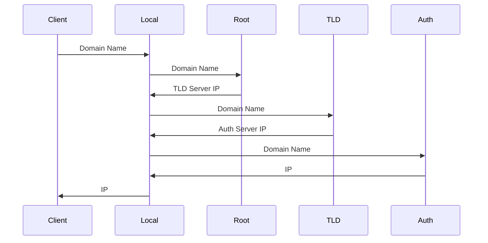

DNS translates hostnames to IP addresses.

- application layer
- based on UDP

> **Why does DNS primarily use the UDP?**
>
> - Speed: UDP is connectionless
> - Simplicity: UDP has a simple protocol structure
>
> **When is TCP used?**
>
> - When the data exceeds 512 Bytes

- [为什么 DNS 使用 UDP 协议](https://draven.co/whys-the-design-dns-udp-tcp/)

## Lookup

## Caching

1. Operating System
2. Browser
3. DNS Servers

## Servers

| Type                          | Description                                |
| ----------------------------- | ------------------------------------------ |
| Local DNS Server              | Proxy Query                                |
| Root DNS Server               | Domain Name -> TLD Server IP               |
| Top-level Domain (TLD) Server | Domain Name -> Authoritative DNS Server IP |
| Authoritative DNS Server      | Domain Name -> IP                          |

## Records

| Type  | Description                           |
| ----- | ------------------------------------- |
| A     | Domain Name -> IPv4                   |
| CNAME | Domain Name Alias -> Domain Name      |
| NS    | Domain Name -> DNS Server Domain Name |
| AAAA  | Domain Name -> IPv6                   |

> **If TLD returns only the domain, how do Local server kown its IP?**
>
> TLD returns a Glue Record: is a type of DNS record that associates a nameserver's hostname with its IP address

## Hijacking

DNS server cached records are tampered with, resulting in an incorrect IP address being returned.

**types**

- router hijacking
- local server hijacking

**Usage**

- block a specific domain name (Great Firewall)
- ISP collects data (redeirect to a particular IP when access an unknown domain)

**Defense**

- changing router passwords
- using VPN
- using Google DNS

## Load Balancing

- [DNS Load Balancing](https://pinggy.io/blog/dns_load_balancing/)

DNS load balancing uses the DNS to distribute site traffic across several servers

**Round-Robin DNS**: The server cyclically returns IP addresses in different orders

