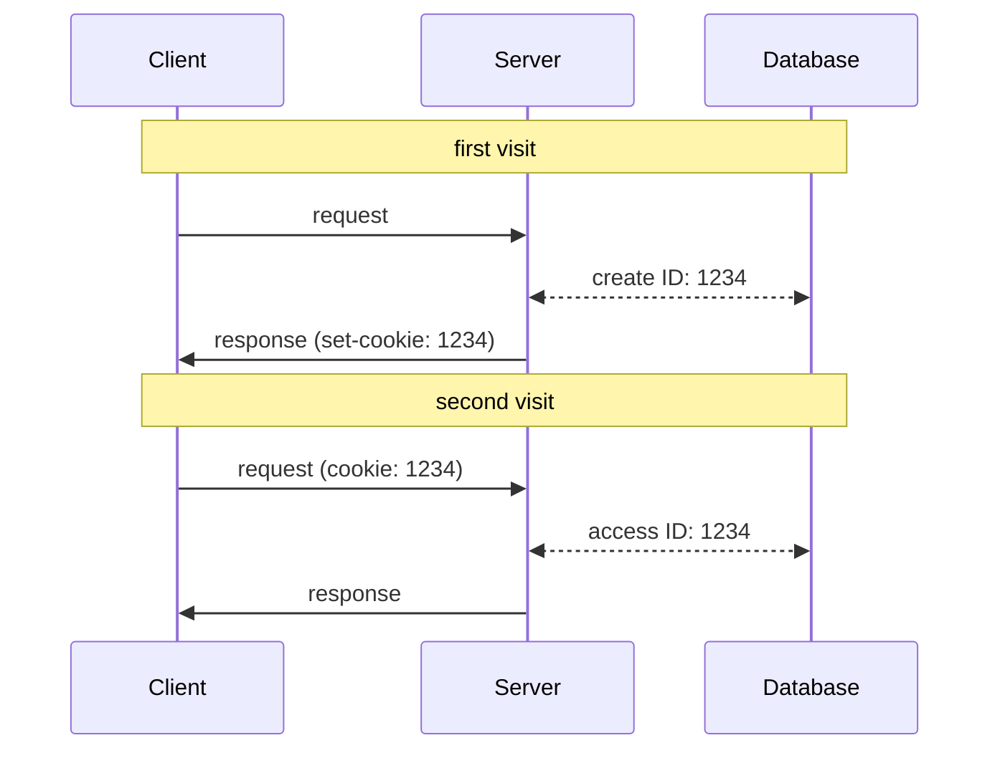
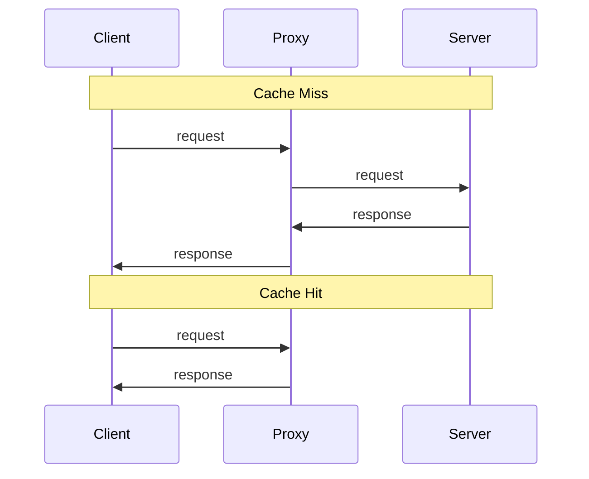
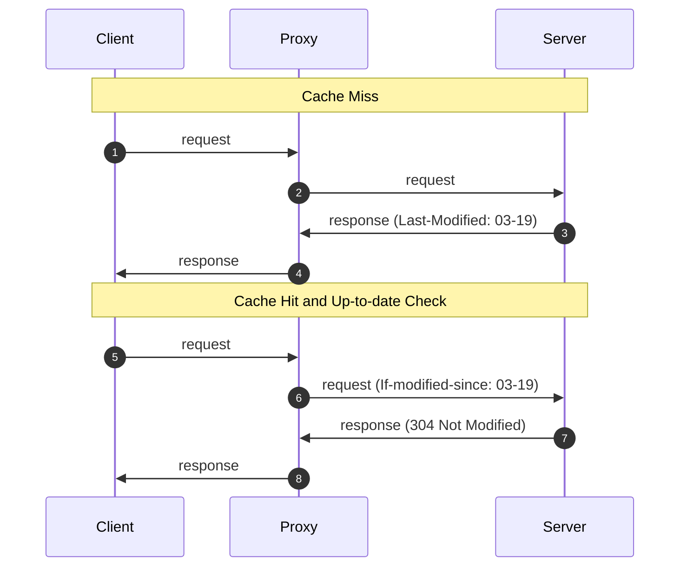

## Messages


1. HTTP Request Message

   ```http
   GET /somedir/page.html HTTP/1.1
   Host: www.someschool.edu
   Connection: close
   User-agent: Mozilla/5.0
   Accept-language: fr
   ```

2. HTTP Response Message

   ```http
   HTTP/1.1 200 OK
   Connection: close
   Date: Tue, 18 Aug 2015 15:44:04 GMT
   Server: Apache/2.2.3 (CentOS)
   Last-Modified: Tue, 18 Aug 2015 15:11:03 GMT
   Content-Length: 6821
   Content-Type: text/html

   (data data data data data ...)
   ```

## Cookie

Because an HTTP server maintains no information about the clients,
HTTP is said to be a **stateless** protocol. However, it is often
desirable for a Web site to identify users, For this purposes, HTTP
uses **cookies**.

Cookie technology has four components:

1. a cookie header line in the HTTP response message
2. a cookie header line in the HTTP request message
3. a cookie file kept on the user’s end system and managed by the user’s browser
4. a back-end database at the Web site



1. fisrt visit
2. the server creates a unique ID in database, then responds to browser, including in the HTTP response a `Set-cookie: ID` header
3. the browser receives the response, then appends a line to the cookie file (includes the hostname of the server and the ID)
4. second visit, the browser consults the cookie file, extracts ID for this site, and puts a cookie header line: `Cookie: ID`
5. the server fetches user information by ID
6. the server responds to browser

## Web Caching

A **Web cache** also called a **proxy server** is a network entity that satisfies HTTP
requests on the behalf of an origin Web server. The Web cache has its own disk
storage and keeps copies of recently requested objects in this storage. Once a browser is configured, each
browser request for an object is first directed to the Web cache. Typically a Web cache is purchased and installed by an ISP.

Benefits:

- reduce the response time for a client request
- reduce traffic on an institution’s access link to the Internet



Although caching can reduce user-perceived response times, it introduces a new
problem: the copy of an object residing in the cache may be stale. Fortunately,
HTTP has a mechanism that allows a cache to verify that its objects are up to date.
This mechanism is called the **conditional GET**.



- Step 3: the Proxy caches the object and the last-modified date locally.
- Step 6: the Proxy performs an up-to-date check by issuing a conditional GET
  1. If the object has not been modified since 03-19. Then, the Server sends a response message, which tells the Proxy that it
     can forward its copy of the object to Client.

> Last-Modified and If-modified-since can be replaced by ETag and If-None-Match.

## HTTP 1

### Persistent Connections

1. **non-persistent connections**

   each request/response pair be sent over a separate TCP connection, delay is 4 RTTs

   ```mermaid
   sequenceDiagram
     Note over Client, Server: TCP Handshake
     Client ->> Server: request
     Server ->> Client: HTML
     Note over Client, Server: TCP Handshake
     Client ->> Server: request
     Server ->> Client: JPEG
   ```

2. **persistent connections**

   each request/response pair be sent over the same TCP connection, delay is 3 RTTs

   ```mermaid
   sequenceDiagram
     Note over Client, Server: TCP Handshake
     Client ->> Server: request
     Server ->> Client: HTML
     Client ->> Server: request
     Server ->> Client: JPEG
   ```

### Pipelining

1. **without pipelining**

   Send HTTP requests after receiving a response, delay is 3 RTTs

   ```mermaid
   sequenceDiagram
     Note over Client, Server: TCP Handshake
     Client ->> Server: request
     Server ->> Client: PNG
     Client ->> Server: request
     Server ->> Client: JPEG
   ```

2. **with pipelining**

   Send multiple HTTP requests without waiting for a response, delay is 2 RTTs

   ```mermaid
   sequenceDiagram
     Note over Client, Server: TCP Handshake
     Client ->> Server: request
     Client ->> Server: request
     Server ->> Client: PNG
     Server ->> Client: JPEG
   ```

## HTTP 2

The primary goals for HTTP/2 are to reduce perceived latency by enabling request
and response multiplexing over a single TCP connection, provide request prioritization
and server push, and provide efficient compression of HTTP header fields. HTTP/2
does not change HTTP methods, status codes, URLs, or header fields. Instead, HTTP/2
changes how the data is formatted and transported between the client and server.

### Framing

Break down an HTTP message into independent frames, interleave them, and
then reassemble them on the other end. The frame is encoded as binary,
are more efficient to parse.


### Response Message Prioritization

When a client sends concurrent requests to a server, it can prioritize the
responses it is requesting by assigning a weight between 1 and 256 to each
message. Using these weights, the server can send first the frames for the
responses with the highest priority.

### Server Pushing

The server can send multiple responses for a single client request.
In addition to the response to the original request, the server can
push additional objects to the client, without the client having to
request each one.

### Header Compression

Compressing using the HPACK algorithm reduces the header size.

## Head of Line Blocking

Using a single TCP connection, the big object will take a long time,
while the small objects are delayed as they wait behind the big object.

1. [HTTP 1](#http-1) work around this problem by opening multiple parallel TCP connections
2. [HTTP 2](#http-2) work around this problem by breaking down an HTTP message into independent frames

> [Pipelining](#pipelining) does not solve this problem.
> On the client side, requests still need to be received in order.
