Services provided by TCP (Transmission Control Protocol):

1. [data delivery (multiplexing)](#multiplexing)
2. [reliable data transfer](#reliable-data-transfer)
3. [congestion control](#congestion-control)

## Header

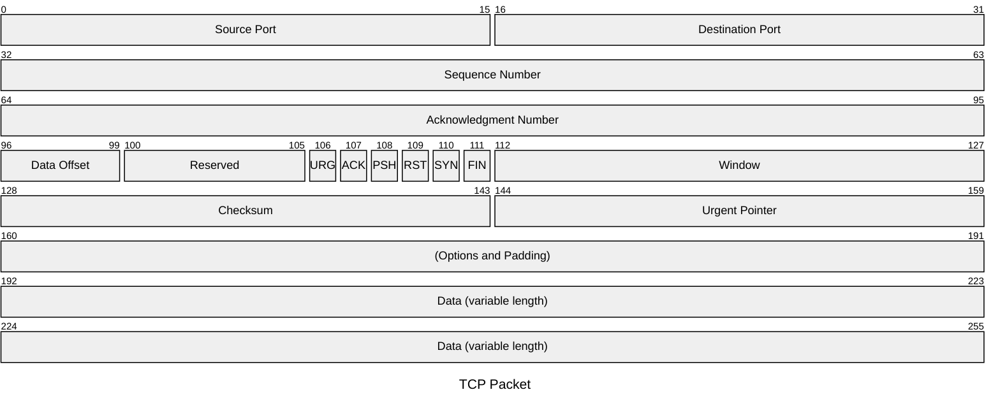

Used for [multiplexing](#multiplexing):

- Source Port
- Destination Port

Used for [reliable data transfer](#reliable-data-transfer):

- Sequence Number
- Acknowledgment Number
- Checksum
- ACK: indicate Acknowledgment Number field is valid

User for [connection establishment](#connection-establishment):

- SYN
- FIN
- RST

Used for [congestion control](#congestion-control):

- Window

Other fields:

- Data Offset: the length of the TCP header (the TCP header can be of variable length)

### Sequence Numbers

Suppose that the file consisting of 500,000 bytes, that the MSS is 1,000 bytes.

- segment 1 gets assigned sequence number 0
- segment 2 gets assigned sequence number 1,000
- segment 500 gets assigned sequence number 499,000


> **MSS (Maximum Segment Size)**
>
> the largest amount of data.

### Acknowledgment Numbers

Suppose that Receiver has received all bytes numbered 0 through 535. Then Sender puts 536 in the acknowledgment number field.

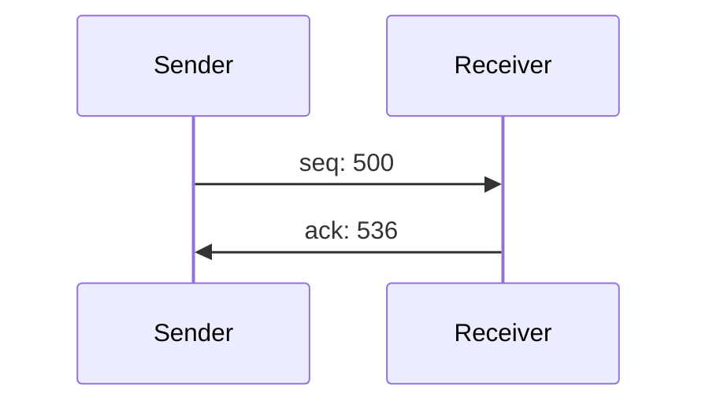

Suppose the starting sequence numbers are 42 and 79 for the client and server.

- "hello": 5 bytes
- "hi": 2 bytes

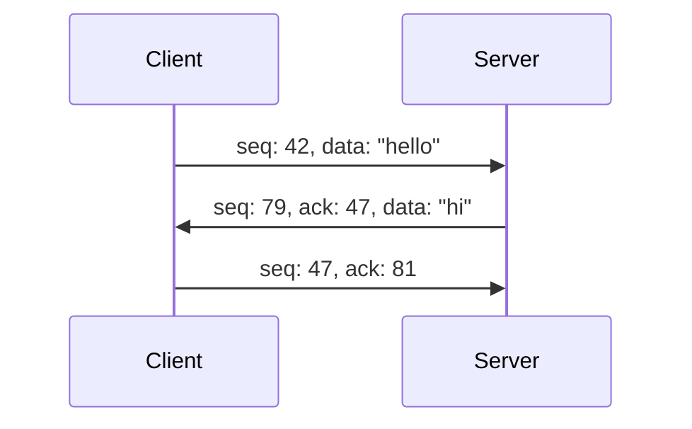

## Multiplexing

Extending the host-to-host delivery service provided by the network layer to a **process-to-process** delivery service.

1. **multiplexing**: gathering data from different sockets, and passing the segments to the network layer
2. **demultiplexing**: delivering the data in segment to the correct socket


> **How does TCP identify a socket?**
>
> TCP socket is fully identified by **(source IP, source Port, destination IP, destination Port)**. if two TCP segments have different source IP or Port, they will be directed to two different sockets.

> **TCP requires establishing a connection**
>
> Unlike UDP, TCP requires establishing a connection. When the server receives a connection request, it creates a new socket. All subsequently arriving segments will be demultiplexed to this socket.

## Reliable Data Transfer

### ARQ (Automatic Repeat reQuest)

- 不丢包 ✅
- 不出错 ✅

假设网络层满足以上条件，实现可靠传输很简单：

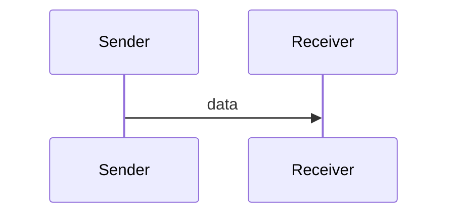

---

- 不丢包 ✅
- 会出错 ❌

假设网络层满足以上条件，则需确保出错的数据被重传，实现重传机制需要增加两个字段：

1. **Checksum**: 检测数据是否出错
2. **Acknowledgment Number**: 反馈结果
   - correct: 返回一次 ACK
   - wrong: 返回两次 ACK

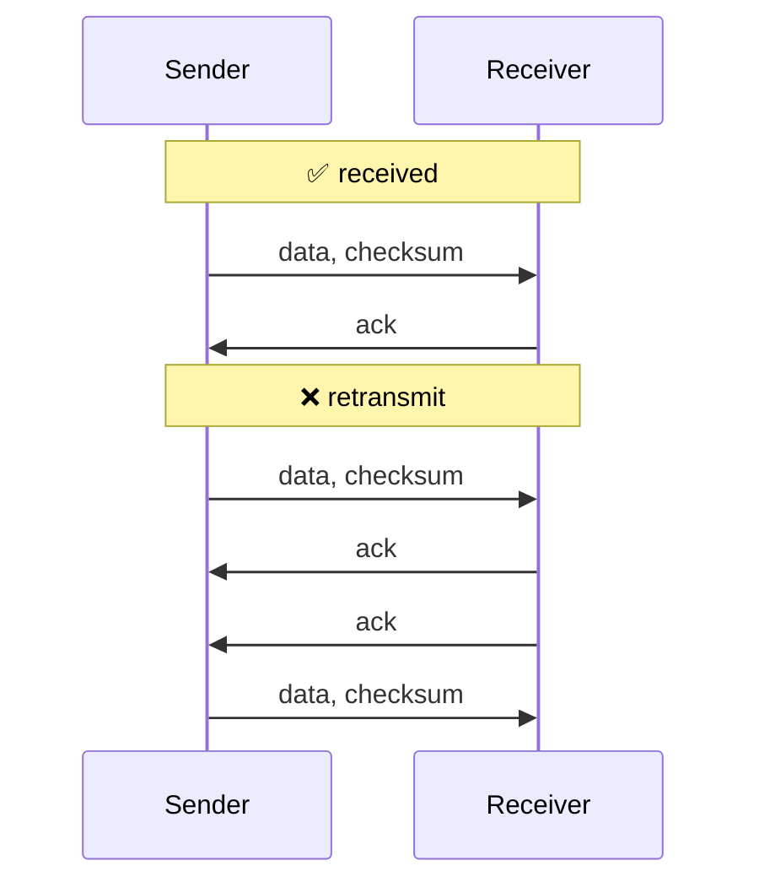

如果 ACK 包也出错，那么发送方在收到错误的 ACK 包后，也需要重传数据。但此时，接收方不知道到达的数据是新数据还是重传数据，因此需要新增一个字段来区分：

1. **Sequence Number**: 确定数据包是否是重传的
   - 重传的数据包：序列号和上一个包相同
   - 新的数据包：序列号和上一个包不同

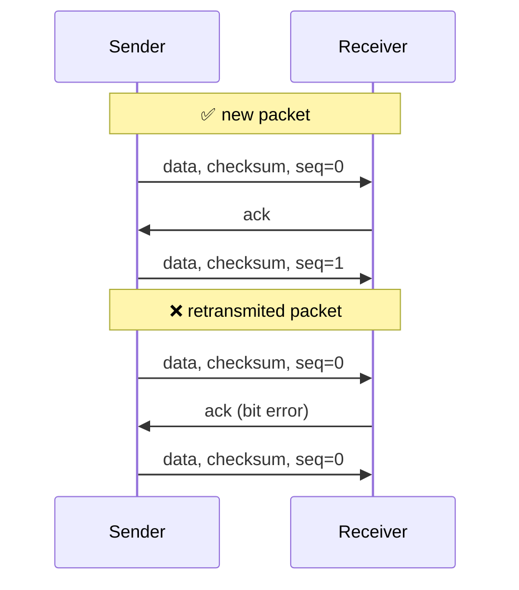

---

- 会丢包 ❌
- 会出错 ❌

假设网络层满足以上条件，如果出现丢包，发送方在等待一段时间后，需要重传数据，丢包有两种情况：

1. Data 包丢了（或超时了）
2. ACK 包丢了（或超时了）

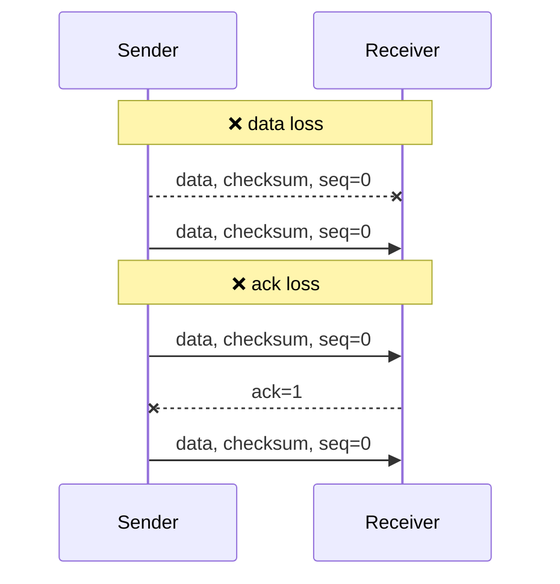

### Stop-and-wait vs Pipelining

- **Stop-and-wait protocols**: 数据包确认接收后，才能发送下一个
- **pipelining protocols**: 允许发送多个数据包而不等待确认

由下图可知 Stop-and-wait 效率低于 Pipelining


在管道协议中，数据包可能会乱序，因此 ACK 需要指定对应的 SEQ，例如：

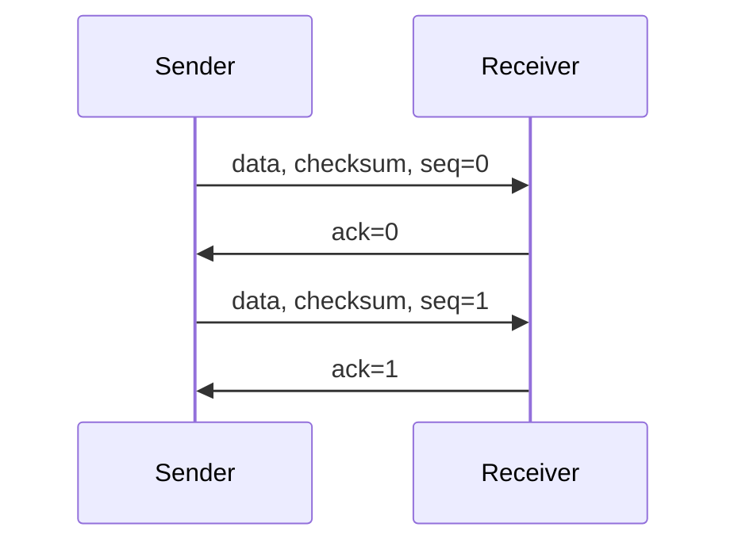

### GBN (Go-Back-N)

GBN 是一个管道协议，但它限制了管道中数据包的数量，即窗口大小。

- 发送方重传时，会重传目标数据包，及其之后的数据包
- 接收方收到逆序数据包时，直接丢弃


### SR (Selective Repeat)

GBN 协议在某个数据包丢失或出错或乱序时，会导致大量数据包被重传，效率较低。而 SR 协议允许保留正确到达的数据包。

- 发送方重传时，只会重传目标数据包
- 接收方收到逆序数据包时，会缓存下来


> **序列号重复**
>
> 由于收发双方的窗口并不是同步的，当 $N < \frac{seqRange}{2}$ 时序列号可能发生重复，例如当 $N = 3$ 且 $seqRange=4$ 时
>
> ```txt
> # 发送方 seq=0,1,2 的 ACK 丢失，正在重传 seq=0
> sender window: [0, 1, 2]
> # 接收方 seq=0,1,2 已确认，窗口右移，此时若收到重传的 seq=0 则会导致错误
> receiver window: [3, 0, 1]
> ```

### Fast Retransmit

One of the problems with timeout-triggered retransmissions is that the timeout period can be relatively long. In the case that three duplicate ACKs are received, the TCP sender performs a fast retransmit, retransmitting the missing segment before that segment’s timer expires.

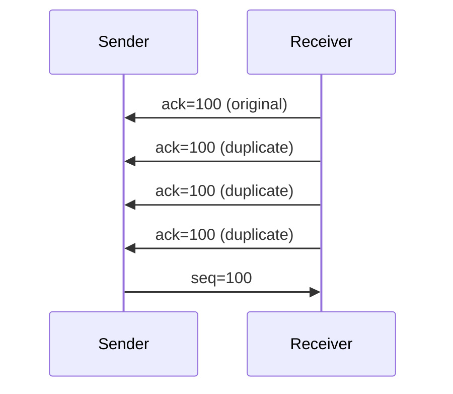

> **Why 3 ACKs, rather than 2 ACKs?**
>
> Since TCP does not know whether a duplicate ACK is caused by a lost segment or just a reordering of segments.

### Flow Control

TCP provides a flow-control service to its applications to eliminate the possibility of the sender overflowing the receiver’s buffer. The sender need makes sure that $LastByteSent – LastByteAcked <= ReceiveWindow$.


### Connection Establishment

The purpose of the three-way handshake is to synchronize the connection state information:

- Sequence Number
- Congestion Window
- MSS

#### Three-way Handshake

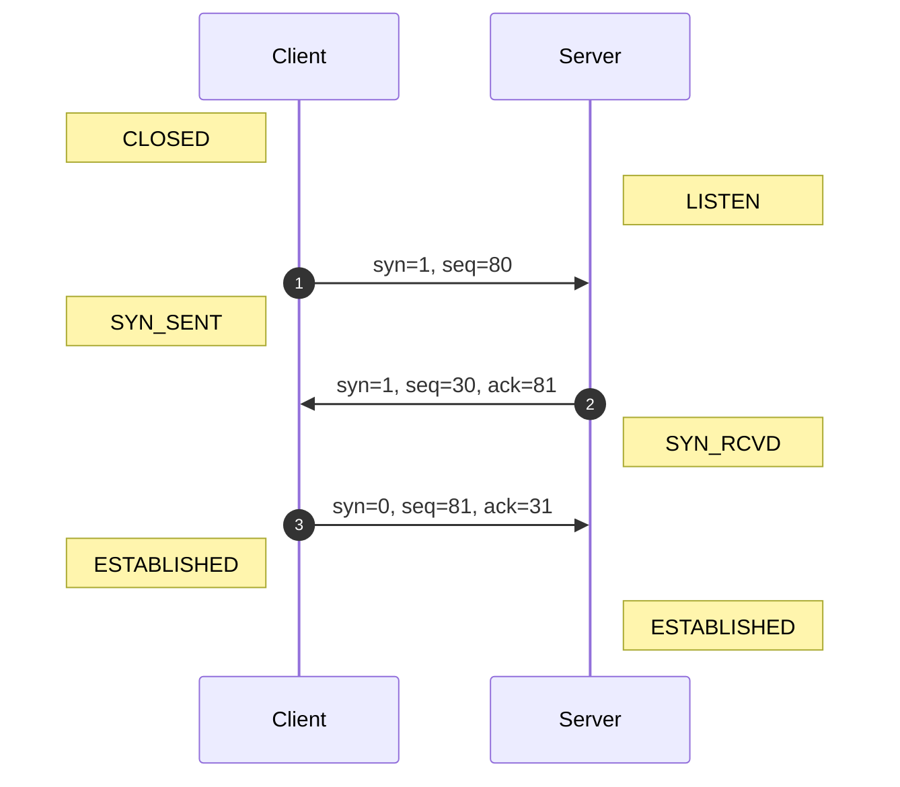

1. set SYN flag to 1, set SEQ to randomly value
2. set SYN flag to 1, set SEQ to randomly value, set ACK to client SEQ + 1
3. set SYN flag to 0, set SEQ to client SEQ + 1, set ACK to server SEQ + 1 **(may carry data)**

> **Why randomly select initial SEQ?**
>
> To avoid collisions with stale segments (segments that are still in the network but belong to a closed TCP connection).
>
> **Why is it three-way handshake instead of two-way handshake?**
>
> To prevent old SYN segments from establishing a connection.
>
> **What happens if handshake packets are lost?**
>
> 1. 1st handshake lost: Client retransmits SYN packet
> 2. 2nd handshake lost: Client retransmits SYN packet, Server retransmits SYN-ACK packet
> 3. 3rd handshake lost: Server retransmits SYN-ACK packet

#### Four-way Handshake

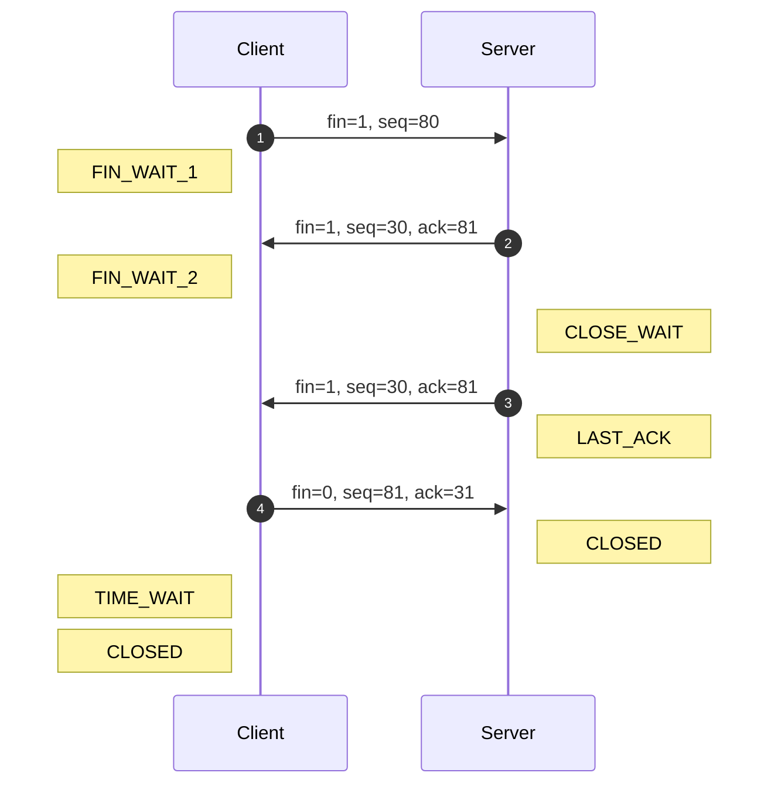

- **TIME_WAIT**: lets the TCP client resend the final ACK in case the ACK is lost.
- **RST flag**: when the socket is not running a service, an RST is returned.

> **Is a three-way handshake okay?**
>
> If the server does not need to send additional data, the second and third steps of the handshake can be combined.
>
> **What happens if handshake packets are lost?**
>
> 1. 1st handshake lost: Client retransmits FIN packet
> 2. 2nd handshake lost: Client retransmits FIN packet
> 3. 3rd handshake lost: Server retransmits FIN packet
> 4. 4th handshake lost: Server retransmits FIN packet
>
> If the FIN packet is never acknowledged, the connection will directly transition to the CLOSED state.

## Congestion Control

### Algorithm


### TCP Tahoe


- x = 4, cwnd >= ssthresh
- x = 8, 3 ACKs, set ssthresh to 6, set cwnd = 1
- x = 12, cwnd >= ssthresh

### TCP Reno


- x = 4, cwnd >= ssthresh
- x = 8, 3 ACKs, set ssthresh to 6, set cwnd = 9
- x = 11, new ACK, set cwnd = 6

### TCP CUBIC

CUBIC only changes the congestion avoidance phase.


