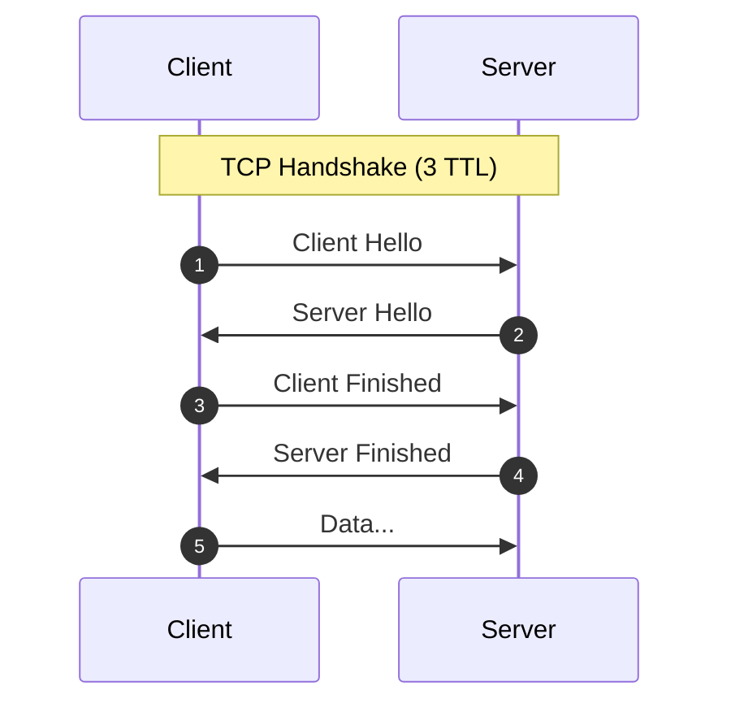
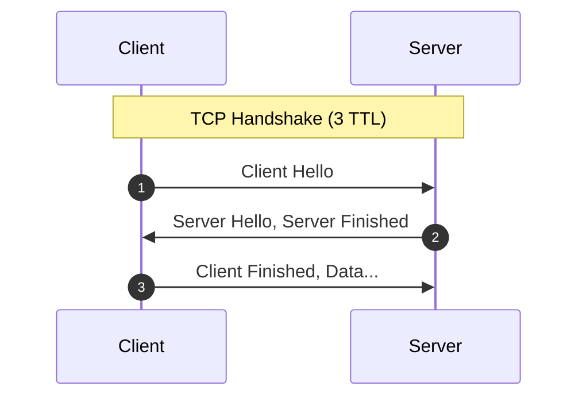

安全通信需要满足以下条件:

- 机密性 (Confidentiality): 使用[加密算法](#加密算法)，保证只有通信双方能理解内容
- 完整性 (Integrity): 使用[摘要算法](#摘要算法)，保证内容没有被篡改
- 身份验证 (Authentication): 使用[数字签名](#数字签名)，保证通信双方能验证对方的身份

## 加密算法

使用**对称加密**进行通信，但是这种方法需要通信双方提前共享一个**对称密钥**

- 加密: $c = K(m)$
- 解密: $m = K(c)$

Where $m$ is message, $c$ is ciphertext, $K$ is symmetric key

```seq
A -> B: 密文
```

使用**非对称加密**进行通信，不需要提前共享密钥

- 加密: $c = K^+_B(m)$
- 解密: $m = K^-_B(c)$

Where $K^+_B$ and $K^-_B$ is B's public key and private key respectively

```seq
B -> A: 公钥
A -> B: 密文
```

由于非对称加密计算量较大，因此通常使用非对称加密来交换对称密钥，然后进行对称加密通信

```seq
B -> A: 公钥
A -> B: 公钥加密的对称密钥
A -> B: 密文
```

### RSA

Key Generation:

1. Choose two large prime numbers `p` and `q`
2. Compute `n = pq` and `z = (p - 1)(q - 1)`
3. Choose a number `e` less than `n` such that `e` and `z` are coprime
4. Choose a number `d` such that `ed mod z = 1`
5. Finally, the public key is `(n, e)` and the private key is `(n, d)`

Encryption and Decryption:

- Encryption: $c = m^e \mod n$
- Decryption: $m = c^d \mod n$

Where $m < n$

### DH

```seq
Client -> Server: p, g, A
Server -> Client: B
```

Key Generation:

1. Client: `p = 7`, `g = 3`, private key `a = 10`, public key `A = g^a mod p = 4`
2. Server: private key `b = 20`, public key `B = g^b mod p = 2`
3. Finally, the client computes the shared key `K = B^a mod p = 2`, the server computes the shared key `K = A^b mod p = 2`

Encryption and Decryption:

- Encryption: $c = K(m)$
- Decryption: $m = K(c)$

## 摘要算法

可以使用**哈希函数**，来进行完整性验证，B 通过计算 $Hash(H) = H$，来判断是否完整

- 哈希: $H = Hash(m)$

```seq
A -> B: m, H
```

### MD5

- output length: 128 bits


### SHA-1

- output length: 160 bits
- safer than MD5
- slower than MD5


### SHA-256

- output length: 256 bits
- safer than SHA-1
- slower than SHA-1


## 数字签名

使用私钥对消息进行签名，通过计算 $m = K^+_B(K^-_B(m))$ 来验证身份

- 签名 (Signature): $S = K^-_B(m)$

```seq
B -> A: m, S
```

> $K^-_B(m)$ 也可以用来验消息完整性

由于私钥加密计算量较大，因此通常不会加密整个消息，而是加密消息的哈希

- 签名 (Signature): $S = K^-_B(Hash(m))$

```seq
B -> A: m, S
```

由于需要确认公钥确实是 B 的，因此需要 CA 提供证书（B 的公钥和 IP 等）予以证明，通过计算 $K^+_{CA}(Certificate)$ 并判断 IP 来验证

- 证书 (Certificate): $C = K^-_{CA}(K^+_B, IP_B)$

```seq
B -> A: m, C
```

## TLS 1.2



- **Step 1**
  - 💬 version list
  - 💬 algorithm list
  - 💬 client random
- **Step 2**
  - 💬 selected version
  - 💬 selected algorithm
  - 💬 server random
  - 💬 certificate
  - ⚙️ **exchange key generation**: the server calculates a private/public keypair for key exchange
  - 💬 server public key
- **Step 3**
  - ⚙️ **exchange key generation**: the client calculates a private/public keypair for key exchange
  - 💬 client public key
  - ⚙️ **encryption keys caculation**: using `server random`, `client random`, `server public key`, `client private key`
  - 💬 **verification data**: built from a hash of all handshake messages
- **Step 4**
  - ⚙️ **encryption keys caculation**: using `server random`, `client random`, `client public key`, `server private key`
  - 💬 **verification data**: built from a hash of all handshake messages

> 1. `random` is used to prevent **playback attack**
> 2. `verification data` is used to verify the integrity of the handshake messages

## TLS 1.3



- **Step 1**
  - 💬 version list
  - 💬 algorithm list
  - 💬 client random
  - ⚙️ **exchange key generation**: the client calculates a private/public keypair for key exchange
  - 💬 client public key list
- **Step 2**
  - 💬 selected version
  - 💬 selected algorithm
  - 💬 server random
  - ⚙️ **exchange key generation**: the server calculates a private/public keypair for key exchange
  - 💬 server public key
  - 💬 certificate
  - ⚙️ **encryption keys caculation**: using `client public key`, `server private key`, `hash of ClientHello and ServerHello`
  - **verification data**: built from a hash of all handshake messages
- **Step 3**
  - ⚙️ **encryption keys caculation**: using `server public key`, `client private key`, `hash of ClientHello and ServerHello`
  - 💬 **verification data**: built from a hash of all handshake messages
