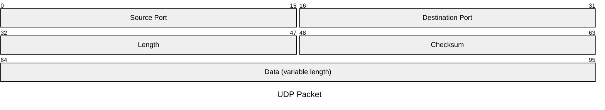

Services provided by UDP (User Datagram Protocol):

- [data delivery (multiplexing)](#multiplexing)
- [error checking](#error-checking)

## Header

Used for [multiplexing](#multiplexing):

- Source Port
- Destination Port

Used for simple data validation:

- Checksum

Other fields:

- Length: the number of bytes in the UDP segment (header plus data)

## Multiplexing

Extending the host-to-host delivery service provided by the network layer to a **process-to-process** delivery service.

1. **multiplexing**: gathering data from different sockets, and passing the segments to the network layer
2. **demultiplexing**: delivering the data in segment to the correct socket

> **How does UDP identify a socket?**
>
> UDP socket is fully identified by **(destination IP, destination Port)**. if two UDP segments have different source IP or Port, but have the same destination IP and Port, they will be directed to the same process via the same socket.

## Checksum

> **Why UDP provides a checksum?**
>
> - may use a link-layer protocol that does not provide error checking
> - bit errors could be introduced when a segment is stored in a router’s memory
