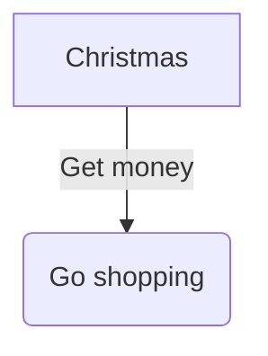

## Italic, Bold

_italic text_, **bold text**.

## table

|                    | for | for-of | forEach |
| ------------------ | --- | ------ | ------- |
| continue           | ✅  | ✅     | ❌      |
| break              | ✅  | ✅     | ❌      |
| return             | ✅  | ✅     | ❌      |
| skip array element | ✅  | ❌     | ❌      |
| skip array hole    | ❌  | ❌     | ✅      |

## list

- unorder list
  - aaa
  - bbb

1. order list
   1. 111
   2. 222

- code 1

  ```js
  let a = 1;
  ```

- code 2code 2code 2code 2code 2code 2code 2code 2code 2code 2code 2code 2code 2code 2code 2code 2code 2code 2code 2

  ```js
  let a = 1;
  ```

1. example 1

```example
おはよう。#早上好。
```

## 强调符号

- **超文本**标记*语言*
- HyperText Markup **Language**，_HTML_
- 東京大学**とう**きょうだい*が*く

## Image



```seq
A -> B: Hello
B -> C: Hi
C -> D: Apple
D -> A: Banana
```

## blockquote

> **This is title**
>
> this is text

## code

this is text, and `this` is code.

```js
let a = 1;
```

```example
おはよう。#早上好。
```

> this is text, and `this` is code.
>
> ```js
> let a = 1;
> ```
